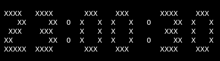

# GDC - Great Digital Clock

This is just a fun little exercise to learn Rust and to
playaround with some Terminal graphics.

A Great Digital Clock is displayed as ASCII graphics;
ticking away every second.

Added bonus: the colons will display a spinning effect.
(idea and Spin-chars, stolen from the `gitui` code base)
